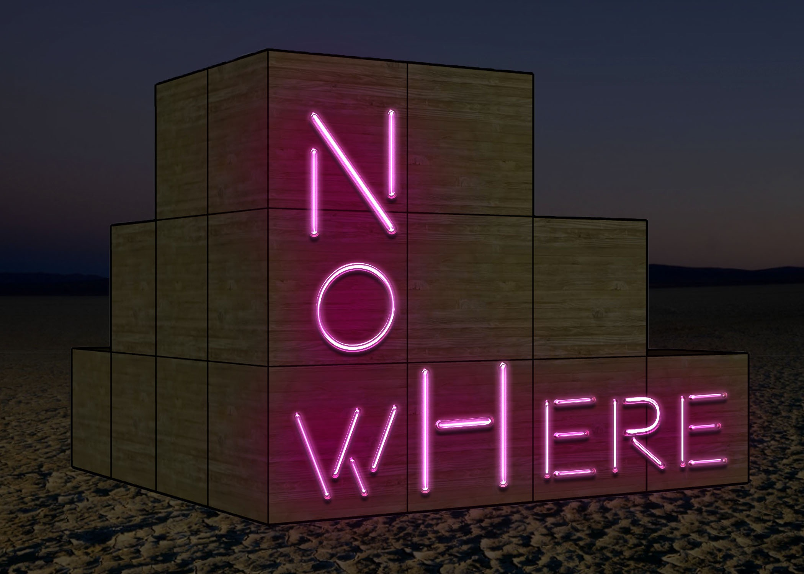

NowHere
=======

> The difference between nowhere and now here is a little space

[Indiegogo Campaign](https://www.indiegogo.com/projects/nowhere-burning-man-2019#/)

Development
-----------

We use Docker to standardize our build environment. This minimizes uncertainty
around cross-complilation by giving us identical base environments and also
keeps out host environments clean. Currently (2019-06-13) we build for the
Ubuntu Bionic (LTS) target via the DockerFile in the root of this repo.
